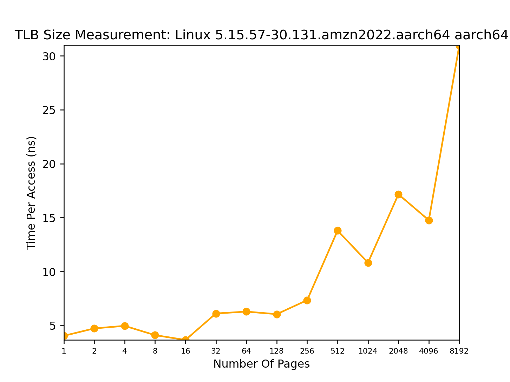
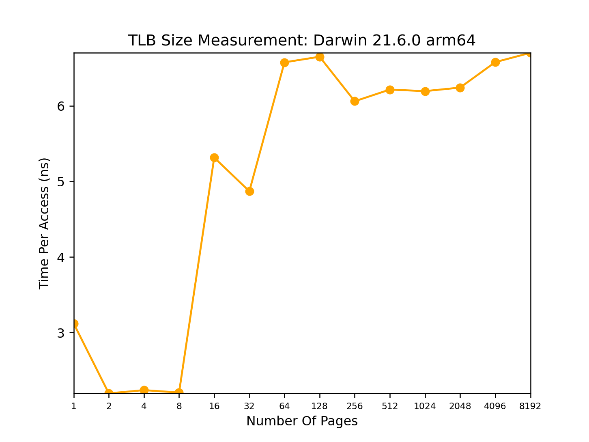

# Chapter 18

## Question 1

Big pages will waste a lot of space for small datas.

## Question 2
As we increase the number of virtual addresses to generate, more of the provided addresses are valid.
## Question 3

8 byte page size is too small.
1mb page size is very high.

## Question 4
**Address size is too big**
python3 paging-linear-translate.py  -a 128k -v -c
ARG seed 0
ARG address space size 128k
ARG phys mem size 64k
ARG page size 4k
ARG verbose True
ARG addresses -1

Error: physical memory size must be GREATER than address space size (for this simulation)

**When address size is 0**
python3 paging-linear-translate.py  -a 0 -v -c   
ARG seed 0
ARG address space size 0
ARG phys mem size 64k
ARG page size 4k
ARG verbose True
ARG addresses -1

Error: must specify a non-zero address-space size.

**Address space is lower than the page size**
python3 paging-linear-translate.py -P 32k -v -c
ARG seed 0
ARG address space size 16k
ARG phys mem size 64k
ARG page size 32k
ARG verbose True
ARG addresses -1

Error in argument: address space must be a multiple of the pagesize

# Chapter 19

## Question 1
`gettimeofday()` has the precision of microseconds. An operation has to take atleast 1 microsecond for it to be measured with this function. For higher precesion `clock_gettime` should be used.

## Question 2

## Question 3

100000 trials.

## Question 4

## Question 5
Using gcc's optimize option gcc -O0 to disable optimization. This is the default setting.

## Question 6

Use taskset on linux and hwloc-bind on macos.

## Question 7

yes this will effect. Use **calloc** to initialize all bytes in the allocated storage to zero.